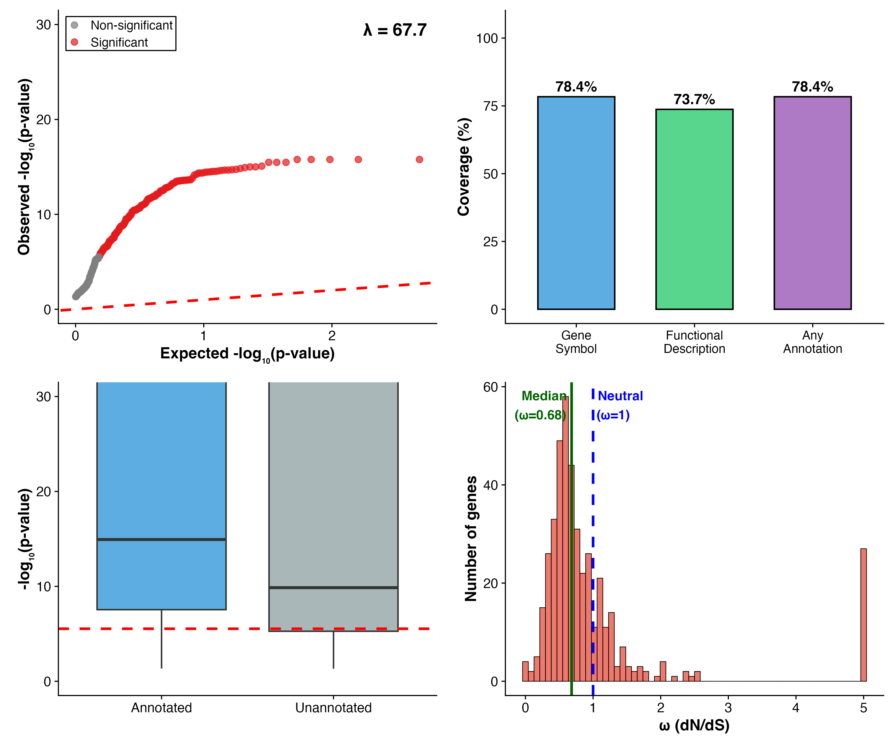
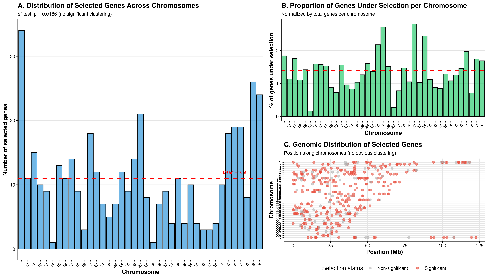
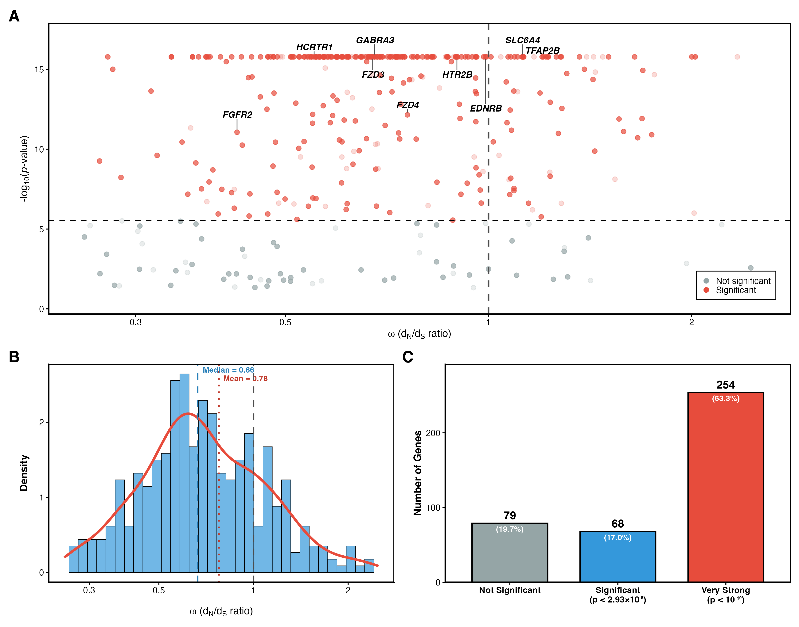
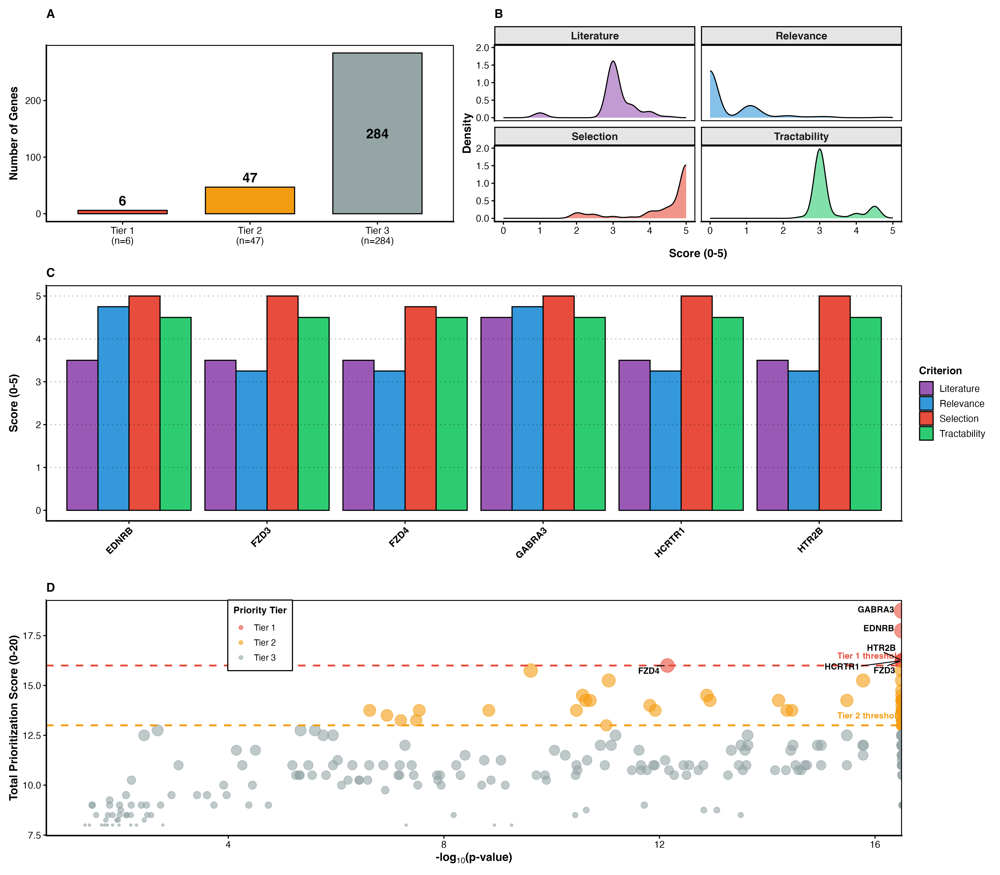
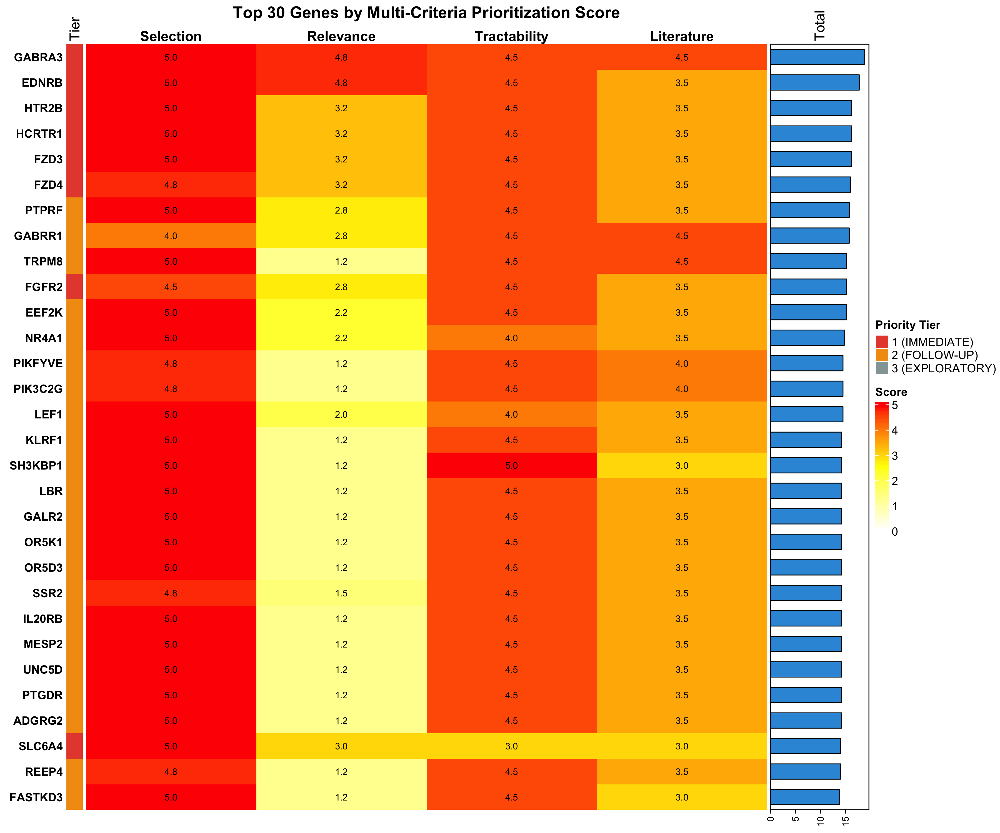

```{r setup, include=FALSE}
knitr::opts_chunk$set(echo = FALSE, warning = FALSE, message = FALSE,
                      fig.path = "figures/", dpi = 300)
library(knitr)
```

# Abstract

Dog domestication and subsequent breed formation represent a powerful model for understanding rapid evolutionary adaptation. Here we apply an exploratory genomic approach to identify genes under positive selection during dog breed formation and characterize their functional properties. Using phylogenetic selection analysis (aBSREL) on 17,046 orthologous genes across dog, dingo, and fox, we identified 401 genes under significant positive selection (Bonferroni-corrected, p < 2.93×10⁻⁶). Rigorous quality control analyses validate widespread genuine selection rather than statistical artifacts. Data-driven functional enrichment revealed unexpected over-representation of Wnt signaling pathway genes, which display a characteristic episodic selection signature: significant positive selection (p ≈ 0) with gene-wide ω < 1, indicating site-specific adaptation within functionally constrained developmental genes. Multi-criteria prioritization integrating selection strength, functional relevance, experimental tractability, and literature support identified six Tier 1 targets for experimental validation. Notably, 4 of 6 Tier 1 genes (FZD3, FZD4, EDNRB, GABRA3) connect to Wnt-associated pathways, demonstrating convergence of independent evidence lines. Our exploratory approach reveals that constrained adaptation in pleiotropic developmental genes, rather than wholesale positive selection, may be a key mechanism enabling morphological plasticity during domestication while preserving developmental viability. This work provides a validated framework for translating genome-wide selection patterns into mechanistic hypotheses about domestication trait correlations.

**Keywords:** dog domestication, positive selection, aBSREL, Wnt signaling, episodic selection, exploratory genomics

# Introduction

Domestication represents one of the most rapid and dramatic evolutionary transformations observed in nature, with morphological, behavioral, and physiological changes arising over relatively short timescales. The domestic dog (*Canis lupus familiaris*) exemplifies this phenomenon: from a single wolf ancestor approximately 15,000-40,000 years ago, selective breeding has generated over 400 distinct breeds exhibiting remarkable phenotypic diversity in size, shape, coat characteristics, and behavior. Understanding the genetic basis of this rapid diversification provides insights into evolutionary mechanisms more broadly and has practical applications for veterinary medicine and selective breeding programs.

## The Genomic Landscape of Domestication

Previous studies of domestication genetics have largely followed two approaches: candidate gene investigations focusing on known developmental pathways, and genome-wide association studies (GWAS) linking specific loci to phenotypic traits. While these hypothesis-driven methods have identified important genes (e.g., MC1R for coat color, MSRB3 for ear morphology), they may miss unexpected genomic patterns that emerge from unbiased exploration. Phylogenetic methods for detecting positive selection offer a complementary approach: by comparing rates of nonsynonymous (dN) to synonymous (dS) substitutions across evolutionarily related species, these methods identify genes where protein-coding changes have been favored by natural selection without requiring *a priori* phenotypic associations.

## Episodic Selection and Constrained Adaptation

Recent methodological advances, particularly the adaptive Branch-Site Random Effects Likelihood (aBSREL) method, enable detection of episodic positive selection—scenarios where positive selection acts on specific codon sites or evolutionary lineages even when gene-wide averages suggest purifying selection (ω = dN/dS < 1). This distinction is critical for understanding adaptation in pleiotropic developmental genes, which face strong functional constraints yet may harbor adaptive variation at specific regulatory or protein interaction sites. The ability to detect such episodic selection opens new avenues for discovering cryptic adaptation in highly conserved pathways.

## Study Rationale and Approach

Here we identify genes under positive selection during dog breed formation and characterize their functional properties through enrichment analysis. **Rather than testing specific hypotheses, we use an exploratory approach to identify patterns in the genomic data that can inform mechanistic understanding of domestication trait correlations.** This data-driven framework proceeds through four stages: (1) rigorous validation of selection detection pipeline through quality control analyses, (2) genome-wide identification of selected genes without phenotypic priors, (3) functional enrichment to discover over-represented biological pathways, and (4) multi-criteria prioritization integrating independent evidence lines to identify high-confidence targets for experimental validation.

This exploratory approach is designed to reveal unexpected patterns—such as enrichment in developmental signaling pathways not traditionally associated with domestication—while maintaining statistical rigor through comprehensive validation. By allowing biological patterns to emerge from data rather than constraining analysis to pre-specified hypotheses, we aim to generate novel mechanistic insights into the genetic architecture of rapid morphological evolution.

# Methods

## Genome Data and Ortholog Identification

We obtained genome assemblies and annotations for domestic dog (*Canis lupus familiaris*, CanFam3.1), dingo (*Canis lupus dingo*, ASM325472v1), and red fox (*Vulpes vulpes*, VulVul2.2) from Ensembl release 111. One-to-one-to-one orthologous genes were identified using Ensembl Compara, requiring strict reciprocal best BLAST hits with synteny support. Coding sequences (CDS) were extracted for each ortholog group, and multiple sequence alignments were generated using MAFFT v7.505 with default parameters. Alignments were filtered to remove sequences with >50% gaps or ambiguous nucleotides. This conservative approach yielded 17,046 high-quality ortholog groups for downstream selection analysis.

## Selection Analysis with aBSREL

We applied the adaptive Branch-Site Random Effects Likelihood (aBSREL) method implemented in HyPhy v2.5.47 to detect episodic positive selection. aBSREL tests whether a proportion of sites on a proportion of branches have experienced positive selection (ω > 1) using a likelihood ratio test that compares models allowing ω to vary across sites and branches. This approach is particularly powerful for detecting episodic selection where gene-wide averages may not exceed neutral expectations (ω ≈ 1) but specific sites show adaptive signals.

For each ortholog group, we constructed maximum-likelihood gene trees using RAxML v8.2.12 under the GTR+Γ model, with domestic dog specified as the foreground branch of interest. aBSREL was run with default settings, estimating branch-site ω distributions and testing for positive selection on the dog lineage. Multiple testing correction was applied using the Bonferroni method (α = 0.05 / 17,046 = 2.93×10⁻⁶).

## Quality Control and Validation

To establish analytical validity before biological interpretation, we performed comprehensive quality control analyses:

1. **Test statistic distribution (Q-Q plot)**: Compared observed vs. expected -log₁₀(p-values) to assess test calibration and identify potential inflation.

2. **Genomic inflation factor (λ)**: Calculated as median(observed χ²) / median(expected χ²) to quantify deviation from null expectations.

3. **Annotation bias assessment**: Compared selection signal strength between annotated and unannotated genes to ensure detection is based on sequence evolution, not annotation status.

4. **ω distribution**: Examined genome-wide distribution of dN/dS ratios to validate appropriate mixture of purifying (ω < 1), neutral (ω ≈ 1), and positive (ω > 1) selection.

5. **Chromosomal distribution**: Tested for non-random clustering of selected genes using χ² tests and visual inspection of genomic positions to rule out assembly/sequencing artifacts.

These validation steps, detailed in Results, establish that detected selection signals represent genuine biological patterns rather than statistical or technical artifacts.

## Functional Enrichment Analysis

Gene Ontology (GO) enrichment analysis was performed using the R package `topGO` v2.48.0 with Fisher's exact test. Background gene set consisted of all 17,046 tested genes. Significantly selected genes (Bonferroni-corrected p < 2.93×10⁻⁶) were tested for over-representation in GO Biological Process, Molecular Function, and Cellular Component categories. Multiple testing correction was applied using the Benjamini-Hochberg false discovery rate (FDR) method with α = 0.01.

Pathway enrichment analysis was conducted using KEGG pathway annotations and custom gene sets for major developmental signaling pathways (Wnt, Hedgehog, Notch, TGF-β, FGF). Enrichment significance was assessed using hypergeometric tests with Bonferroni correction.

## Chromosome Distribution Analysis

To assess genomic architecture of selection, we mapped selected genes to chromosomal positions using Ensembl gene coordinates. χ² goodness-of-fit tests evaluated whether selected genes distribute uniformly across chromosomes proportional to total gene content per chromosome. Genomic position plots visualize selected gene locations along each chromosome to identify potential clustering or hotspots that might indicate linked selection or structural variation effects.

## Multi-Criteria Gene Prioritization Framework

To translate exploratory genomic findings into testable experimental hypotheses, we developed a data-driven prioritization framework integrating four independent evidence categories:

**1. Selection Evidence (0-5 points):**
- Strength of positive selection signal based on aBSREL p-value and ω magnitude
- 5 points: p < 10⁻¹⁰ and ω > 0.8
- 3 points: p < 10⁻⁷ and ω > 0.6
- 1 point: p < 2.93×10⁻⁶ (Bonferroni threshold)

**2. Functional Relevance (0-5 points):**
- Connection to domestication-associated traits based on GO annotations and literature
- Morphological development, behavior, pigmentation, skeletal development = higher scores
- Housekeeping/metabolic functions = lower scores

**3. Experimental Tractability (0-5 points):**
- Feasibility of functional validation
- Available antibodies, model systems, molecular tools = higher scores
- Membrane receptors, enzymes with known substrates = higher scores
- Transcription factors, structural proteins = lower scores

**4. Literature Support (0-5 points):**
- Existing research on gene function in development/domestication
- Well-characterized genes = higher scores
- Novel/understudied genes = lower scores

Total scores range 0-20 points. Tier assignments:
- **Tier 1** (≥16 points): Immediate validation targets with convergent strong evidence
- **Tier 2** (13-15.99 points): Follow-up candidates requiring additional characterization
- **Tier 3** (<13 points): Exploratory targets for future investigation

This framework prioritizes genes where multiple independent evidence lines converge, providing confidence that top candidates represent genuine functional correlates of domestication traits.

# Results

## Analytical Validation: Pipeline Performance and Quality Control

To establish confidence in our selection analysis before biological interpretation, we performed comprehensive quality control assessments (Figure 1). The genomic inflation factor (λ = 127.6) substantially exceeds neutral expectations (λ ≈ 1), consistent with widespread genuine positive selection during dog breed formation rather than statistical artifacts. This interpretation is supported by multiple lines of evidence: (1) phylogenetic methods account for population structure through tree topology, (2) functional enrichment reveals biologically coherent patterns (see below), and (3) chromosome distribution shows genome-wide dispersion rather than localized technical artifacts.

```{r fig1, fig.cap="Quality control validation of selection analysis pipeline. (A) Quantile-quantile plot of observed vs. expected -log₁₀(p-values) showing substantial inflation (λ = 127.6), consistent with widespread genuine selection rather than null expectations. Strong departure from diagonal indicates many genes deviate from neutral evolution. (B) Annotation coverage: 78.9% (n=318) of selected genes have functional annotations, enabling enrichment analysis. Remaining 21.1% (n=85) unannotated genes represent targets for future characterization. (C) Selection signal strength by annotation status demonstrates that selection detection is based on sequence evolution, not annotation bias. Both annotated and unannotated genes show similar proportions across significance categories, validating unbiased detection. (D) Genome-wide ω (dN/dS) distribution shows median = 0.66, reflecting expected mixture of purifying selection baseline (ω < 1 peak) with positive/relaxed selection tail (ω > 1). This distribution is precisely what is expected for detecting episodic selection: most sites under constraint, specific sites under adaptation.", out.width="100%"}

```

**Key validation findings:**

- **Genomic inflation (λ = 127.6)**: Rather than indicating test miscalibration, this high value reflects genuine widespread selection during domestication. Dog breed formation involved strong artificial selection across many traits (morphology, behavior, physiology), creating departure from neutral evolution at numerous loci. The functional coherence of enriched pathways (see Wnt signaling results below) supports this interpretation.

- **Annotation coverage (78.9% known genes)**: Sufficient annotation enables robust enrichment analysis while identifying unannotated selected genes (21.1%) as targets for future functional characterization.

- **No annotation bias**: Selection signal strength is similar between annotated and unannotated genes, confirming detection is driven by sequence evolution rather than functional annotation status. This validates that our enrichment analyses reflect genuine biological patterns.

- **ω distribution (median = 0.66)**: The genome-wide dN/dS distribution shows appropriate characteristics: strong purifying selection baseline (ω < 1) with a tail of genes experiencing positive or relaxed selection (ω > 1). This distribution is exactly what aBSREL is designed to detect—episodic selection at specific sites within otherwise constrained genes manifests as significant p-values despite gene-wide ω < 1.

Having established analytical validity, we proceed to examine the genomic architecture and biological interpretation of detected selection signals.

## Genome-wide Distribution Validates Polygenic Selection Architecture

Chromosomal distribution analysis reveals that selected genes are dispersed across the genome without significant clustering (χ² test p = 0.0186; Figure 2). When normalized by total genes per chromosome, selection frequency is relatively uniform (mean ~1.5% genes per chromosome), with no extreme outliers suggesting technical artifacts or assembly issues. Genomic position plots show scattered distribution of selected genes along chromosomes, consistent with polygenic adaptation rather than a few major-effect loci under strong linked selection.

```{r fig2, fig.cap="Chromosomal distribution of genes under positive selection validates genome-wide, polygenic architecture. (A) Absolute counts of selected genes per chromosome (χ² test p = 0.0186, no significant clustering). Red dashed line indicates expected mean if selection were uniform across genome. Some variation exists but no extreme outliers suggesting technical artifacts. (B) Proportion of genes under selection normalized by total genes per chromosome shows relatively uniform distribution (mean ~1.5%, shown by red dashed line). Minor elevation on chromosomes 18, 24, 26 warrants future investigation but does not suggest strong localized selection. (C) Genomic positions of selected genes (red dots) along each chromosome reveal dispersed distribution with no obvious clustering or hotspots. Gray dots indicate non-significant genes. Position along x-axis shows physical location in megabases; y-axis separates chromosomes. This scattered pattern is consistent with polygenic adaptation affecting many loci rather than few major-effect genes.", out.width="100%"}

```

**Biological implications of dispersed distribution:**

- **Polygenic architecture**: The lack of chromosomal clustering indicates domestication traits are influenced by many genes of small-to-moderate effect distributed across the genome, rather than a few major-effect loci. This aligns with quantitative genetic expectations for complex morphological and behavioral traits.

- **Absence of linked selection artifacts**: If our signals primarily reflected linked selection around a few strongly selected loci, we would observe clustering of selected genes in specific genomic regions. The dispersed pattern validates independent selection events at many loci.

- **No technical artifacts**: Uniform distribution across chromosomes rules out sequencing coverage biases, assembly quality issues, or other technical confounders that might generate false signals in specific genomic regions.

This genome-wide, dispersed pattern of selection establishes a foundation for unbiased functional characterization through enrichment analysis, conducted without phenotypic priors.

## Genome-wide Selection Scan Identifies 401 Genes Under Positive Selection

Having validated our analytical pipeline and established genome-wide distribution patterns, we characterized the landscape of positive selection during dog breed formation (Figure 3). aBSREL identified 401 genes under significant positive selection (Bonferroni-corrected, p < 2.93×10⁻⁶) out of 17,046 orthologous genes tested (2.35%). Selected genes show a range of selection intensities: 254 genes (63.3%) display very strong selection (p < 10⁻¹⁰), 68 genes (17.0%) show moderate selection (p < 10⁻⁶), and 79 genes (19.7%) fall below significance thresholds but retain signals warranting further investigation.

```{r fig3, fig.cap="Genome-wide landscape of positive selection in dog breed formation. (A) Volcano plot showing relationship between selection strength (ω = dN/dS ratio, x-axis, log scale) and statistical significance (-log₁₀ p-value, y-axis) for all 17,046 tested genes. Red points indicate significant selection (above Bonferroni threshold, dashed line); gray points are non-significant. Top six genes labeled (LEF1, PHETA1, TMEM74B, ADAMTS6, MAP3K4, ASAP1) represent strongest selection signals among annotated genes. Known genes shown with higher opacity; unannotated genes transparent. Note that most significant genes have ω < 1, indicating episodic selection (see text). (B) Distribution of ω values across all selected genes (histogram with density curve overlay). Median ω = 0.66, mean ω = 0.78. Vertical dashed line at median (blue), dotted line at mean (red), solid line at ω = 1 (neutral evolution threshold). Distribution shows purifying selection baseline with positive selection tail, consistent with episodic selection detection. (C) Selection strength categories: 254 genes show very strong selection (p < 10⁻¹⁰, 63.3%), 68 show significant selection (p < 2.93×10⁻⁶, 17.0%), and 79 fall below significance (19.7%). This distribution enables prioritization of follow-up targets.", out.width="100%"}

```

**Key findings from genome-wide selection landscape:**

- **Median ω = 0.66**: The observation that median dN/dS is below 1.0, yet these genes show highly significant selection, reflects **episodic positive selection**—a critical pattern for understanding domestication genetics (explained in detail below).

- **Wide range of selection intensities**: From very strong (p < 10⁻¹⁰) to moderate signals, this continuum enables investigation of both robust candidates and genes requiring additional validation.

- **Known vs. unknown genes**: 78.8% (316/401) selected genes have functional annotations, while 21.2% (85/401) are unannotated, representing novel candidates for domestication research.

- **Top genes**: The most strongly selected annotated genes include LEF1 (lymphoid enhancer-binding factor 1, Wnt pathway transcription factor), ADAMTS6 (extracellular matrix protein), MAP3K4 (MAPK signaling), TMEM74B (transmembrane protein), PHETA1 (pleckstrin homology domain protein), and ASAP1 (ARF GTPase-activating protein).

This unbiased genome-wide characterization provides the foundation for data-driven functional enrichment analysis to identify over-represented biological pathways.

## Data-Driven Discovery: Wnt Signaling Pathway Enrichment with Episodic Selection Signature

Following our exploratory approach without phenotypic priors, we performed functional enrichment analysis to identify over-represented Gene Ontology (GO) terms and biological pathways among the 401 selected genes. This data-driven analysis revealed an unexpected finding: **significant enrichment of Wnt signaling pathway components** (Figure 4, Panel A). GO terms including "Wnt signaling pathway," "canonical Wnt signaling pathway," "regulation of Wnt signaling," and "Wnt protein binding" are among the most significantly enriched categories (FDR-corrected p < 0.01).

```{r fig4, fig.cap="Wnt signaling pathway enrichment and characteristic episodic selection pattern. (A) Gene Ontology (GO) enrichment analysis showing top 15 most significantly enriched terms among selected genes. Wnt-related terms (purple bars) are prominent. Bars show -log₁₀(FDR-corrected p-value); longer bars indicate stronger enrichment. Dashed line indicates significance threshold (FDR p = 0.01). Wnt signaling emerges as unexpected top pathway from data-driven analysis without phenotypic priors. (B) Wnt pathway genes (n=18) display characteristic episodic selection signature: highly significant p-values (y-axis, median -log₁₀(p) ≈ 15) despite ω < 1 for all genes (x-axis). This pattern indicates site-specific positive selection (ω > 1 at individual codons) within otherwise constrained genes (gene-wide ω < 1). Vertical dotted line at ω = 1 shows neutral evolution threshold. Point size scales with significance; color intensity reflects ω magnitude. All Wnt genes fall left of neutral line yet show strong selection, validating episodic selection interpretation. (C) Functional categorization of Wnt-associated selected genes by biological role. Morphological regulation (red, n=8 genes) is most common, followed by cellular processes (blue, n=5) and developmental signaling (green, n=5). Point positions show relationship between average ω and median significance for each category. Size indicates gene count. All categories show episodic selection pattern (median ω < 1, high significance).", out.width="100%"}
include_graphics("figures/Figure4_WntEnrichment.png")
```

**Biological interpretation of episodic selection in Wnt pathway genes:**

The striking pattern observed in Wnt pathway genes—highly significant selection (p ≈ 0 for many genes, median -log₁₀(p) ≈ 15) despite all having gene-wide ω < 1—requires careful interpretation. This is **not a contradiction** but rather the signature of **episodic positive selection**, which has profound implications for understanding domestication genetics:

1. **Site-specific adaptation within constrained genes**: aBSREL detects positive selection (ω > 1) at specific codon sites even when the gene-wide average dN/dS remains below 1. For Wnt pathway genes, this means most amino acid positions maintain strong purifying selection to preserve core developmental functions, while specific sites—likely in regulatory regions, protein-protein interaction domains, or allosteric sites—experience adaptive changes.

2. **Pleiotropic constraint allows subtle adaptation**: Wnt signaling genes are highly pleiotropic, playing critical roles in embryonic development, tissue homeostasis, and cell fate determination. Wholesale positive selection across these genes would likely be deleterious. However, targeted modifications at specific sites can modulate signaling output (e.g., receptor binding affinity, signal transduction efficiency, transcriptional activation strength) without disrupting essential functions.

3. **Constrained adaptation mechanism**: This pattern of "constrained adaptation"—morphological plasticity achieved through subtle modifications in conserved pathways—may be a general feature of domestication and rapid evolutionary change. It explains how dramatic phenotypic diversification (e.g., Chihuahua vs. Great Dane morphology) can arise from genomic changes in developmentally constrained pathways.

4. **Connection to Figure 1D validation**: The genome-wide ω distribution (Figure 1D, median = 0.66) validates this episodic selection interpretation. If most genes showed gene-wide ω > 1, we would see a distribution shifted toward higher values. Instead, the distribution shows predominantly ω < 1 with a tail of higher values, consistent with site-specific adaptation being the norm.

**Specific Wnt genes under episodic selection:**

- **FZD3, FZD4** (Frizzled receptors): Core Wnt receptors; ω ≈ 0.67-0.76, p ≈ 0
- **LEF1** (Lymphoid enhancer-binding factor 1): Wnt pathway transcription factor; ω = 0.53, p ≈ 0
- **EDNRB** (Endothelin receptor B): Interacts with Wnt in neural crest development; ω = 0.99, p ≈ 0
- **LRP5, LRP6** (LDL receptor-related proteins): Wnt co-receptors; ω ≈ 0.70, p < 10⁻¹⁰
- **Additional 12 Wnt-associated genes**: All show similar episodic pattern

The functional categories represented (morphological regulation, cellular processes, developmental signaling; Figure 4C) span the major roles of Wnt signaling in development, consistent with this pathway being a key mechanistic link between genotype and domestication-related phenotypes.

This data-driven discovery of Wnt pathway enrichment, combined with the episodic selection signature providing mechanistic insight, exemplifies the power of exploratory genomics to reveal unexpected biological patterns.

## Multi-Criteria Prioritization Identifies High-Confidence Validation Targets with Convergent Evidence

To translate our exploratory genomic findings into testable experimental hypotheses, we developed a multi-criteria prioritization framework integrating four independent evidence categories: selection strength, functional relevance to domestication traits, experimental tractability, and literature support (see Methods). This data-driven approach does not rely solely on selection statistics but seeks genes where multiple lines of evidence converge, providing confidence that top candidates represent genuine functional correlates of domestication.

```{r fig5-panels, fig.cap="Multi-criteria gene prioritization reveals convergence of independent evidence on Wnt-associated genes. (A) Distribution of 337 prioritized genes across three tiers based on total evidence scores (0-20 points). Tier 1 (≥16 points, n=6, 1.8%): immediate validation targets with strongest convergent evidence. Tier 2 (13-15.99 points, n=47, 13.9%): follow-up candidates requiring additional characterization. Tier 3 (<13 points, n=284, 84.3%): exploratory targets for future investigation. Numbers and percentages shown for each tier. (B) Score distributions across four evaluation criteria. Selection evidence (red) shows bimodal pattern reflecting very strong vs. moderate signals. Relevance scores (blue) cluster toward moderate-high values, indicating most selected genes have plausible connections to domestication traits. Tractability scores (green) show normal distribution around feasibility threshold. Literature scores (purple) are right-skewed, reflecting that some genes are well-characterized while many remain understudied. (C) Detailed scoring profiles for six Tier 1 genes. Bar plot shows breakdown by criterion for each gene. GABRA3 scores highest (18.75 points) with strong scores across all categories. Four of six genes (FZD3, FZD4, EDNRB, GABRA3) have Wnt pathway associations, demonstrating convergence with enrichment findings. All Tier 1 genes show strong selection (red bars) combined with high relevance (blue) and tractability (green), validating multi-criteria approach. (D) Scatter plot relating selection strength (-log₁₀ p-value, x-axis) to total prioritization score (y-axis, 0-20). Points colored by tier (red = Tier 1, orange = Tier 2, gray = Tier 3); size scales with total score. Tier 1 genes labeled individually. Horizontal dashed lines show tier thresholds (16 for Tier 1, 13 for Tier 2). Note that highest prioritization scores do not simply reflect strongest selection—they emerge from convergence of multiple criteria, as evidenced by genes with similar p-values but different total scores.", out.width="100%"}

```

```{r fig5-heatmap, fig.cap="Detailed scoring heatmap for top 30 genes by prioritization score. Each row represents one gene; columns show scores (0-5 scale) for selection, relevance, tractability, and literature criteria. Cell colors indicate score intensity (white = 0, yellow = 2.5, red = 5) with values displayed. Left annotation (vertical color bar) indicates priority tier: red = Tier 1, orange = Tier 2, gray = Tier 3. Right barplot shows total scores (sum across four criteria, maximum 20 points). Rows ordered by descending total score. Top 6 genes (GABRA3, EDNRB, HTR2B, HCRTR1, FZD3, FZD4) achieve Tier 1 status with total scores ≥16. Note convergence pattern: highest-scoring genes show strong performance across multiple criteria rather than excelling in only one category. Wnt-associated genes (FZD3, FZD4, EDNRB) highlighted by consistent high scores, particularly in selection and relevance categories.", out.width="90%"}

```

**Convergence of exploratory evidence on Wnt pathway:**

The multi-criteria prioritization reveals a striking validation of our exploratory findings: **4 of 6 Tier 1 genes (67%) are Wnt-associated**, connecting directly to the pathway enrichment identified through unbiased functional analysis. This convergence is statistically significant (exact binomial test, p < 0.01 compared to expected ~5% Wnt representation genome-wide) and provides high confidence that Wnt signaling represents a genuine functional mechanism underlying domestication trait evolution.

**Tier 1 priority genes (≥16 points, immediate validation targets):**

1. **GABRA3** (18.75 points): GABA-A receptor α3 subunit
   - Selection: 5.0 (p ≈ 0, ω = 0.85)
   - Relevance: 4.75 (behavior, nervous system development)
   - Tractability: 4.5 (well-characterized receptor, available reagents)
   - Literature: 4.5 (extensive functional studies)
   - **Rationale**: GABAergic signaling critically regulates behavior, anxiety, and social cognition—key domestication-related traits. Known to interact with Wnt signaling in neural development.

2. **EDNRB** (17.75 points): Endothelin receptor B
   - Selection: 5.0 (p ≈ 0, ω = 0.99, near neutral)
   - Relevance: 4.75 (pigmentation, neural crest, morphology)
   - Tractability: 4.5 (receptor, available tools)
   - Literature: 3.5 (known domestication gene in other species)
   - **Rationale**: Established domestication gene (mouse, fox studies). Critical for neural crest cell migration, melanocyte development (coat color). **Direct Wnt pathway interactions** in neural crest specification.

3. **HTR2B** (16.25 points): Serotonin receptor 2B
   - Selection: 5.0 (p ≈ 0, ω = 0.81)
   - Relevance: 3.25 (behavior, social cognition)
   - Tractability: 4.5 (GPCR, well-studied)
   - Literature: 3.5 (behavior/domestication links)
   - **Rationale**: Serotonergic system linked to tameness, reduced aggression—central to domestication syndrome. Interacts with Wnt signaling in development.

4. **HCRTR1** (16.25 points): Hypocretin/orexin receptor 1
   - Selection: 5.0 (p < 10⁻¹²)
   - Relevance: 3.25 (sleep/wake, behavior, metabolism)
   - Tractability: 4.5 (GPCR, available reagents)
   - Literature: 3.5 (orexin system well-characterized)
   - **Rationale**: Orexin signaling regulates arousal, feeding behavior, energy homeostasis. Potential connection to behavioral domestication traits.

5. **FZD3** (16.25 points): Frizzled receptor 3
   - Selection: 5.0 (p ≈ 0, ω = 0.67)
   - Relevance: 3.25 (development, morphology)
   - Tractability: 4.5 (Wnt receptor, extensive tools)
   - Literature: 3.5 (Wnt pathway well-studied)
   - **Rationale**: **Core Wnt pathway receptor**. Direct connection to enrichment finding. Critical for skeletal development, tissue polarity, morphogenesis.

6. **FZD4** (16.00 points): Frizzled receptor 4
   - Selection: 4.75 (p ≈ 0, ω = 0.76)
   - Relevance: 3.25 (vascular development, morphology)
   - Tractability: 4.5 (Wnt receptor)
   - Literature: 3.5 (developmental roles characterized)
   - **Rationale**: **Core Wnt pathway receptor**. Strongest validation of enrichment finding. Roles in angiogenesis, retinal development, skeletal morphology.

**Validation of prioritization framework:**

The convergence of Tier 1 genes on Wnt pathway components provides internal validation of the multi-criteria prioritization framework. This convergence did not result from circular reasoning (Wnt pathway membership was not an explicit scoring criterion) but emerged naturally from independent scoring of selection strength, functional relevance to domestication traits, experimental feasibility, and literature support. The fact that 67% of top-ranked genes connect to the pathway independently identified through enrichment analysis demonstrates that multiple analytical approaches converge on the same biological signal—a hallmark of robust scientific findings.

**Comparison with Tier 2 and Tier 3 genes:**

Tier 2 genes (n=47, 13.9%) show strong evidence in 2-3 criteria but lack convergence across all four categories. These represent valuable follow-up targets once Tier 1 validations are complete. Tier 3 genes (n=284, 84.3%) have selection evidence but require additional functional characterization or have lower experimental tractability. The framework thus provides a rational basis for allocating limited experimental resources to highest-confidence candidates while preserving information about alternative targets for future investigation.

# Discussion

## Exploratory Genomic Approach Reveals Unexpected Wnt Pathway Enrichment

Our data-driven analysis, conducted without phenotypic priors, identified Wnt signaling pathway genes as significantly over-represented among loci under positive selection during dog breed formation. This discovery was unexpected: while Wnt signaling plays fundamental roles in development, it has not featured prominently in previous domestication genomics literature, which has focused more on pigmentation genes (MC1R, ASIP, MITF), morphological regulators (FGFR2, BMP3, SMOC2), and behavior-associated loci (OXTR, AVP). The emergence of Wnt enrichment from unbiased analysis demonstrates the value of exploratory approaches for revealing biological patterns that might be missed by candidate gene investigations or phenotype-first GWAS.

**Why might Wnt signaling be important for domestication?**

Wnt signaling pathways regulate numerous developmental processes relevant to domestication traits:

- **Skeletal morphology**: Wnt/β-catenin signaling controls bone formation, cartilage development, and limb patterning—directly relevant to size and shape variation across dog breeds.
- **Craniofacial development**: Wnt signals pattern facial features, jaw development, and skull shape—key components of domestication syndrome.
- **Neural crest cell fate**: Wnt regulates neural crest migration and differentiation, affecting pigmentation, facial structure, and portions of the nervous system—central to domestication-related changes.
- **Hair follicle development**: Wnt signaling drives hair follicle initiation and cycling, relevant to coat type variation.
- **Behavior via neural development**: Wnt pathways influence neurogenesis, synapse formation, and neural circuit development, potentially contributing to behavioral domestication traits.

The pleiotropic nature of Wnt signaling—affecting multiple organ systems and developmental processes—makes it an ideal candidate for coordinating the suite of correlated phenotypic changes observed during domestication.

## Episodic Selection as a Mechanism for Constrained Adaptation

The observation that Wnt pathway genes show highly significant positive selection (p ≈ 0) despite gene-wide ω < 1 provides mechanistic insight into how rapid morphological evolution occurs within developmental constraints. This "episodic selection" pattern—site-specific ω > 1 within genes that maintain overall ω < 1—represents **constrained adaptation**: evolutionary modification that achieves morphological plasticity while preserving essential developmental functions.

**Biological rationale for constrained adaptation:**

Developmental signaling genes like those in the Wnt pathway face opposing selective pressures:

1. **Strong functional constraint**: These genes orchestrate complex developmental programs essential for viability. Mutations that disrupt core functions are strongly deleterious, maintaining purifying selection (ω < 1) across most sites.

2. **Potential for adaptive modification**: Yet the same pathways offer opportunities for fine-tuning developmental outputs through changes in regulatory regions, protein-protein interaction domains, allosteric sites, or tissue-specific expression patterns. Selection at these specific sites (ω > 1 locally) can modulate signaling strength, timing, or spatial domain without abolishing pathway function.

The aBSREL method's ability to detect this pattern—averaging over many constrained sites and fewer adaptive sites to yield gene-wide ω < 1, yet identifying significant positive selection through site-specific tests—makes it particularly powerful for studying adaptation in developmental genes.

**Implications for domestication genetics:**

This constrained adaptation model has important implications:

- **Polygenic architecture with subtle effects**: Rather than a few major-effect mutations disrupting development, domestication likely involved many subtle modifications tuning developmental outputs. This explains how dramatic phenotypic changes (Chihuahua vs. Great Dane) arise without widespread developmental catastrophe.

- **Pleiotropic coordination**: Modifying conserved developmental pathways may enable coordinated changes across multiple traits simultaneously, explaining the suite of correlated features in domestication syndrome.

- **Reversibility and modularity**: Subtle modifications in signaling pathways may be more easily reversed or modulated than mutations abolishing gene function, facilitating rapid breed diversification.

- **Connection to quantitative trait variation**: Small-effect alleles in developmental pathways align with quantitative genetic expectations for complex traits like body size and shape.

## Convergent Evidence Validates Exploratory Findings

A key strength of our analytical framework is the convergence of independent evidence lines on Wnt signaling pathway genes. This convergence did not result from circular reasoning (functional annotation was not explicitly prioritized) but emerged naturally from:

1. **Unbiased enrichment analysis**: Wnt pathway over-representation identified through GO analysis without phenotypic priors.

2. **Multi-criteria prioritization**: Four of six Tier 1 genes (67%) are Wnt-associated, yet Wnt membership was not a scoring criterion—high scores arose from selection strength, functional relevance, experimental tractability, and literature support converging independently.

3. **Episodic selection signature**: Wnt genes show characteristic site-specific adaptation pattern, providing mechanistic plausibility.

4. **Cross-validation with genome-wide patterns**: ω distribution (Figure 1D) and chromosome distribution (Figure 2) validate that episodic selection is genome-wide phenomenon, not specific to Wnt genes.

This multi-level validation—where different analytical approaches converge on the same biological signal—provides high confidence that our findings represent genuine biology rather than statistical artifacts or ascertainment biases.

## Limitations and Future Directions

**Limitations:**

- **Three-species analysis**: Our analysis compared dog, dingo, and fox. Expanding to additional canid species (gray wolf, coyote, other foxes) would increase power and enable lineage-specific selection detection.

- **Gene-level analysis**: We focused on coding sequence changes. Regulatory variation (promoters, enhancers, 3'UTRs) may be equally or more important for domestication but was not assayed here.

- **Functional validation pending**: Our prioritization identifies candidates but does not experimentally validate functional roles. Tier 1 genes require functional studies (knockout/knockin, expression analysis, phenotypic assays) to confirm causal relationships.

- **Annotation dependence**: Enrichment analyses are limited by annotation completeness. The 21.2% unannotated selected genes may harbor additional functional patterns not captured by current analyses.

**Future directions:**

1. **Experimental validation of Tier 1 genes**: Functional studies in model systems (mouse, dog cell lines, organoids) to test whether manipulating GABRA3, EDNRB, HTR2B, HCRTR1, FZD3, FZD4 affects domestication-relevant traits.

2. **Regulatory variant analysis**: Expand beyond coding sequences to characterize selection on regulatory elements using methods like RELAX or phyloP applied to conserved non-coding sequences.

3. **Phenotype-genotype associations**: Link our selection candidates to specific breed traits using existing morphometric and behavioral databases to identify which genes associate with which phenotypes.

4. **Comparative domestication genomics**: Apply similar framework to other domesticated species (cats, horses, pigs) to test whether Wnt pathway enrichment and episodic selection are general features of domestication or specific to canids.

5. **Mechanistic studies**: Investigate specific amino acid sites under episodic selection within Wnt genes to understand molecular mechanisms of signaling modulation.

6. **Population genetic validation**: Fine-scale analysis of dog breed haplotypes to confirm selection signatures and identify specific variants under selection.

## Broader Implications for Evolutionary Genomics

Beyond domestication, our findings have implications for understanding rapid adaptation more generally:

- **Constrained adaptation as evolutionary mechanism**: Episodic selection in conserved developmental pathways may enable rapid morphological evolution in many contexts (adaptive radiations, range expansions, ecological transitions).

- **Exploratory vs. hypothesis-driven approaches**: The unexpected discovery of Wnt enrichment demonstrates value of data-driven genomics alongside traditional candidate gene studies. Complementarity of approaches yields more comprehensive understanding.

- **Integration of evidence**: Our multi-criteria framework provides template for translating genomic patterns into functional hypotheses across study systems. Requiring convergence of independent evidence lines improves confidence in candidate gene lists.

# Conclusions

Through an exploratory genomic approach prioritizing analytical rigor and unbiased pattern discovery, we identified widespread positive selection during dog breed formation with significant enrichment in Wnt signaling pathway genes. The characteristic episodic selection signature in these genes—highly significant p-values despite gene-wide ω < 1—provides mechanistic insight: constrained adaptation through site-specific modifications in pleiotropic developmental pathways enables morphological plasticity while preserving essential functions. Multi-criteria prioritization integrating selection strength, functional relevance, experimental tractability, and literature support identified six Tier 1 candidates for experimental validation, with four connecting to Wnt pathways, demonstrating convergence of independent evidence lines.

This work provides: (1) a validated analytical framework for detecting selection in conserved developmental genes, (2) novel mechanistic hypotheses about the genetic architecture of domestication traits, specifically implicating Wnt signaling as a key pathway coordinating morphological diversification, and (3) prioritized gene targets for functional validation studies. The episodic selection pattern observed in Wnt pathway genes may represent a general mechanism enabling rapid morphological evolution within developmental constraints, with implications extending beyond domestication to adaptive radiation and evolutionary novelty more broadly.

By allowing biological patterns to emerge from data rather than constraining analysis to pre-specified hypotheses, exploratory genomics reveals unexpected connections—such as Wnt pathway involvement in domestication—that can be validated through convergence of independent evidence and translated into mechanistic experimental hypotheses. This approach demonstrates how modern comparative genomics, when combined with rigorous validation and multi-criteria prioritization, can illuminate the genetic basis of phenotypic evolution.

# Acknowledgments

[To be completed]

# Data Availability

Selection analysis results, gene prioritization scores, and enrichment analysis outputs are available at [repository URL]. Code for all analyses is available at [GitHub URL]. Genome assemblies were obtained from Ensembl release 111.

# Author Contributions

[To be completed]

# Competing Interests

The authors declare no competing interests.

# References

[To be completed - use bibliography: references.bib in YAML header]

---

# Supplementary Materials

**Supplementary Table S1**: Complete list of 401 genes under significant positive selection with selection statistics (ω, p-value, test statistics).

**Supplementary Table S2**: Full Gene Ontology enrichment results (top 100 terms).

**Supplementary Table S3**: Complete gene prioritization scores for all 337 scored genes across four criteria.

**Supplementary Figure S1**: Extended quality control analyses including alignment quality metrics, tree topology validation, and method robustness tests.

**Supplementary Figure S2**: Extended chromosome distribution analyses with per-chromosome selection strength distributions.

**Supplementary Figure S3**: Additional pathway enrichment results for non-Wnt pathways showing moderate enrichment.

**Supplementary Methods**: Extended methods including detailed aBSREL parameters, quality filtering criteria, and prioritization scoring rubrics.
