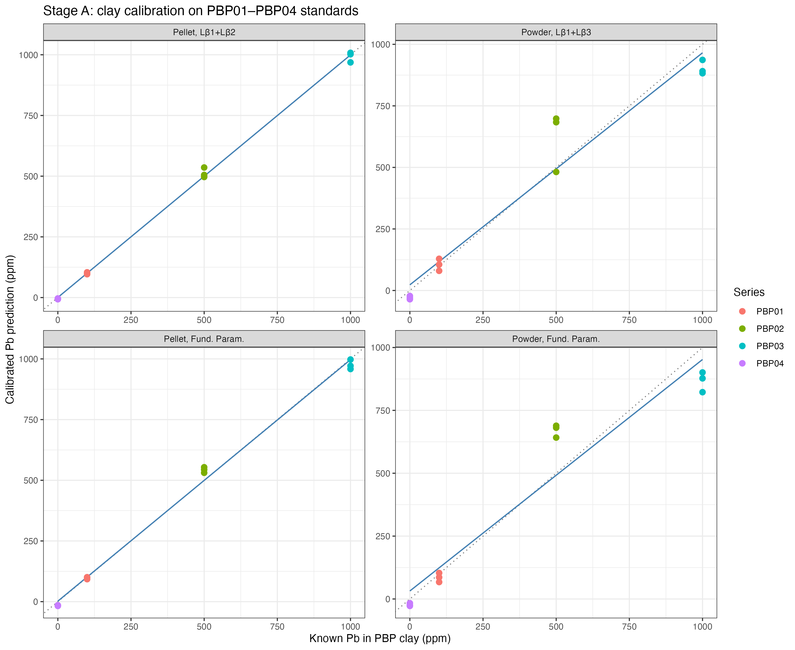
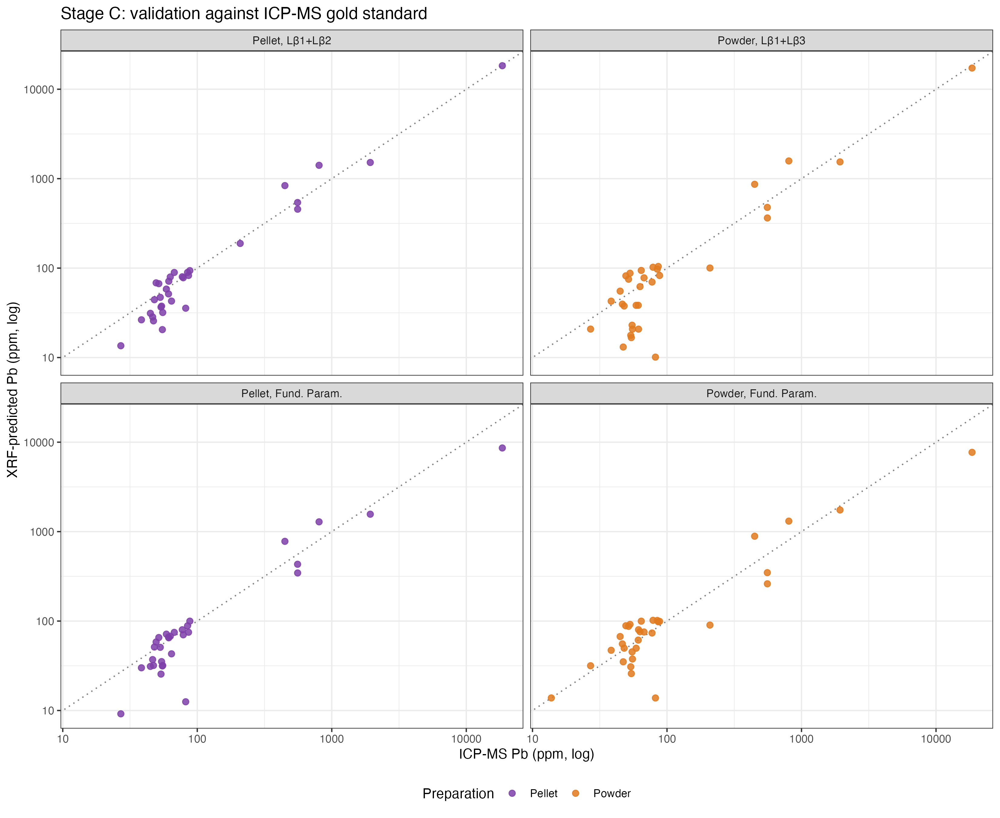
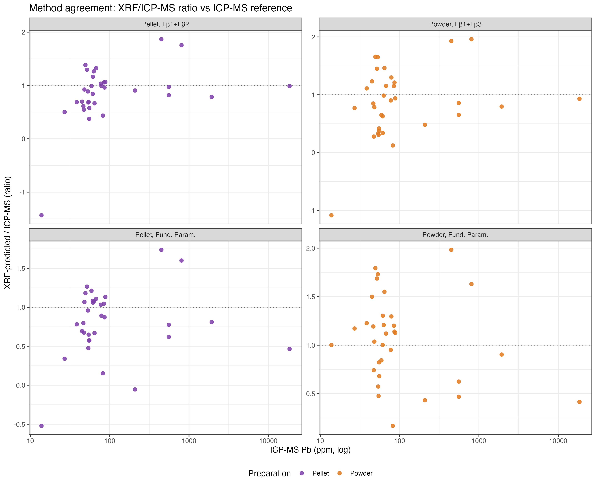

# Statistical Framework: XRF Pb Prediction Pipeline

A walkthrough of the three-stage statistical workflow used to predict Pb in
Eaton Fire ash from benchtop XRF measurements, calibrated against ICP-MS
ground truth. Pipeline source: [eaton_xrf_pipeline.R](scripts/eaton_xrf_pipeline.R).

The pipeline runs four arms in parallel:

| Method | Response variable | Use |
|---|---|---|
| pellet_intensity | Pb Lβ₁ + Lβ₂ multi-predictor | recommended primary screening |
| powder_intensity | Pb Lβ₁ + Lβ₃ multi-predictor | field-portable alternative |
| pellet_FP | instrument FP-derived ppm | comparison baseline |
| powder_FP | instrument FP-derived ppm | comparison baseline |

---

## Stage A — Clay calibration on PBP01–PBP04 standards

**Goal.** Convert a raw XRF response (counts/s on the chosen Pb L-line, or the
instrument's FP-derived ppm) into a first-pass Pb prediction in ppm units,
anchored to four kaolinite-clay standards spiked at 0, 100, 500, and 1000 ppm
Pb (3 replicate preparations each, n = 12 for all methods).

**Model.** Ordinary least-squares linear regression:

```
Pb_known = a + b · response   (lm in R)
```

**Fitted equations (from n = 12 clay standards):**

```r
# L-intensity models (multi-predictor)
Pellet:  Pb_clay = -16.4 - 70.7·Lβ₁ + 151.5·Lβ₂   (R² = 0.999, RMSE = 14 ppm)
Powder:  Pb_clay = -52.6 + 430.2·Lβ₁ - 3327.1·Lβ₃  (R² = 0.943, RMSE = 94 ppm)

# Fundamental parameters models (single-predictor)
Pellet:  Pb_clay = -27.2 + 0.326·FP_raw            (R² = 0.995, RMSE = 28 ppm)
Powder:  Pb_clay = -41.1 + 0.785·FP_raw            (R² = 0.920, RMSE = 111 ppm)
```

Note: The opposing signs in L-intensity coefficients reflect predictor collinearity;
the net effect produces accurate estimates. FP slopes < 1 indicate the instrument
over-reports Pb in the clay matrix.

**Diagnostics.**
- **Cal R²** — fraction of variance in known Pb explained by the response.
  All four arms exceed 0.92; intensity arms reach 0.94–0.999.
- **Cal RMSE** — root-mean-square error on the calibration set itself
  (in-sample residuals): 14–111 ppm depending on method.


*Figure: Clay calibration curves for all four methods.*

**Code.** [eaton_xrf_pipeline.R:103-108](scripts/eaton_xrf_pipeline.R#L103-L108) inside `run_arm()`.

---

## Stage B — Ash matrix correction (clay → ash transfer)

**Goal.** The clay calibration is anchored to a kaolinite matrix; ash has
different mass-attenuation properties and matrix elements. Stage A applied
to ash gives a biased prediction `Pb_clay`. Stage B fits a single
multiplicative factor that absorbs this systematic clay-to-ash bias.

**Model — proportional regression (no intercept).**

```
Pb_ICP-MS  =  m · Pb_clay        slope:  m̂ = Σ(x·y) / Σ(x²)
```

No intercept because Stage A already produced output in ppm units; any
remaining systematic offset is multiplicative (a function of the mass-
attenuation ratio between ash and clay), not additive. An intercept would
let the regression absorb noise that should not exist.

**Two robustness layers wrap this fit:**

### B.1 — Cook's distance outlier filter (D > 4/n)

For each ash sample we compute Cook's D under the proportional model:

```
D_i  =  (r_i² · h_i)  /  ( (1 − h_i)² · σ̂² )
        with  h_i = x_i² / Σx²    leverage
              r_i = y_i − m̂·x_i  residual
              σ̂² = Σr² / (n − 1)  scale
```

Samples with D > 4/n (the conventional threshold) are excluded from slope
fitting only; they still appear in validation. **Why this matters:** sample
XPAH28 (ICP-MS Pb = 18,528 ppm — an order of magnitude above the next-highest
sample) has Cook's D between 360 and 600 across the four arms versus typical
D < 1. Without this filter, XPAH28 alone determines the slope; with it, two
or three samples are excluded per arm and the slope reflects the bulk of the
data.

Code: [eaton_xrf_pipeline.R:78-84, 163-164](scripts/eaton_xrf_pipeline.R#L78-L84).

### B.2 — Per-sample LOOCV slope

For each *eligible* (non-excluded) sample, we refit the slope leaving that
sample out of the fit but predicting it from the held-out slope. This avoids
in-sample optimism without sacrificing the small (n=33) validation set.

```
for i in eligible:
    others <- eligible \ {i}
    m_LOOCV[i]  <-  Σ(x_j·y_j) / Σ(x_j²)   for j in others
    Pb_pred[i]  <-  m_LOOCV[i] · Pb_clay[i]
```

Code: [eaton_xrf_pipeline.R:139-144](scripts/eaton_xrf_pipeline.R#L139-L144).

---

## Stage C — Validation against ICP-MS

Two complementary frameworks: **continuous-metric** (treats Pb as a quantity
to estimate) and **categorical** (treats Pb as a binary classification
relative to a regulatory threshold).

### C.1 — Continuous metrics (Table 3)

For each arm, on the 33 paired ash samples:

| Metric | Formula | Interprets |
|---|---|---|
| Pearson *r* | corr(Pb_pred, Pb_ICP-MS) | linear association strength |
| RMSE | √mean((Pb_pred − Pb_ICP-MS)²) | typical prediction error magnitude |
| MAE | mean(\|Pb_pred − Pb_ICP-MS\|) | median-like error (less sensitive to XPAH28) |
| BA bias | mean(Pb_ICP-MS − Pb_pred) | systematic over/under-prediction |
| BA 95% LOA | bias ± 1.96·SD(diff) | range that contains 95% of differences |
| LOA range | LOA_hi − LOA_lo | width of the agreement band |

The Bland–Altman framework¹ assesses *method interchangeability* — would XRF
substitute for ICP-MS in a clinical/regulatory decision? A small bias and a
narrow LOA range say yes; a wide LOA range says the methods cannot be used
interchangeably even if their correlation is high. **Pellet-intensity** has
the smallest LOA range (601 ppm), an order of magnitude tighter than the
FP arms (>6700 ppm).

Code: [eaton_xrf_pipeline.R:148-158](scripts/eaton_xrf_pipeline.R#L148-L158).


*Figure: XRF-predicted vs ICP-MS Pb concentration for all four methods.*


*Figure: Method agreement shown as XRF/ICP-MS ratio vs ICP-MS concentration.*

### C.2 — Threshold classification (Table 4)

For each combination of (arm × regulatory threshold), build the 2×2
confusion matrix:

```
                    Pb_pred > T    Pb_pred ≤ T
   Pb_ICP-MS > T  │     TP      │     FN     │   ← n_+ (positives)
   Pb_ICP-MS ≤ T  │     FP      │     TN     │   ← n_- (negatives)
```

From the confusion matrix, compute performance metrics:

```r
# R code for classification metrics
sensitivity <- TP / (TP + FN)  # true-positive rate
specificity <- TN / (TN + FP)  # true-negative rate
accuracy    <- (TP + TN) / n   # overall correct fraction
```

| Metric | Formula | Interpretation |
|--------|---------|----------------|
| Sensitivity | TP / (TP + FN) | Proportion of true positives correctly identified |
| Specificity | TN / (TN + FP) | Proportion of true negatives correctly identified |
| Accuracy | (TP + TN) / n | Overall correct classification rate |

For screening applications, **high sensitivity is prioritized** to minimize false
negatives (missed contamination).

The six thresholds span the regulatory framework: 80 (DTSC residential),
200 (EPA RSL), 320 (CHHSL industrial), 500 (DTSC industrial), 800 (EPA
industrial), 1000 ppm (California TTLC).

#### Wilson 95% binomial confidence intervals

For a proportion `p̂ = k/n` (e.g., sensitivity), Wilson² gives:

```
                  p̂ + z²/(2n)  ±  z·√( p̂(1-p̂)/n  +  z²/(4n²) )
   CI_Wilson  =  ─────────────────────────────────────────────────
                              1 + z²/n
                                                      with z = 1.96
```

**Why Wilson, not normal-approximation Wald?** With n = 33 and only 2–11
positives at the higher thresholds, the Wald CI `p̂ ± 1.96·√(p̂(1-p̂)/n)`
collapses to zero width when `p̂ = 1.00` (no uncertainty reported, which is
nonsense) and underestimates uncertainty for extreme proportions in general.
Wilson handles small n and `p̂ → 0` or `→ 1` correctly; it never gives
zero-width CIs and stays bounded in [0, 1].

For `p̂ = 1.00` with n = 6 (sensitivity at 320 ppm): Wilson gives
`[0.61, 1.00]`, honestly reflecting that only 6 above-threshold samples
were observed and a ~40% chance some real sample-population sensitivity
below 1 would still produce 6/6 in a draw of 6.

Code: [eaton_xrf_pipeline.R:88-97, 100-117](scripts/eaton_xrf_pipeline.R#L88-L117).

### C.3 — Pooled cumulative summary (Table 5)

For each arm, sum the confusion-matrix counts across all six thresholds:

```
TP_pool  =  Σ_t  TP_arm,t        (across t ∈ {80, 200, 320, 500, 800, 1000})
n_+_pool =  Σ_t  n_+_t  =  34    sample-threshold pairs above threshold
n_-_pool =  Σ_t  n_-_t  =  164   sample-threshold pairs below threshold
```

This treats each sample-threshold pair as one independent classification
test (33 × 6 = 198 tests per arm) and yields a single sens/spec/acc per
method with much narrower Wilson CIs (n_+ = 34 instead of 2–11). The
pooled metric is the cleanest one-glance summary for comparing methods
across the regulatory range.

**Caveat.** Sample-threshold pairs are not strictly independent — a sample's
classification at 80 ppm is correlated with its classification at 200 ppm
because both depend on the same underlying Pb_pred. The pooled CIs are
therefore *anti-conservative* (slightly tighter than they should be); but
since the rank-ordering of methods is robust to this, the pooled summary is
useful for relative comparison even if the absolute CIs are an
over-confident.

Code: [eaton_xrf_pipeline.R:240-261](scripts/eaton_xrf_pipeline.R#L240-L261).

---

## Why these choices, in one sentence each

- **Two-stage calibration (clay → ash) instead of fitting ash directly.**
  Pulling the in-sample fit on ash would be circular; clay anchors give an
  independent calibration with known truth.
- **Proportional regression for Stage B.** Stage A already produces ppm units;
  the residual bias is multiplicative (matrix attenuation), not additive.
- **LOOCV instead of holdout.** Holdout estimates are seed-dependent because
  XPAH28's leverage dominates whichever partition contains it.
- **Cook's D > 4/n filter.** Standard convention; also empirically captures
  the two known leverage points (XPAH28, JPL73) without dropping legitimate
  high-Pb samples.
- **Negative predictions retained (no floor-clipping).** The clay calibration
  extrapolates to negative Pb for 1–2 ash samples per method with very low
  true Pb (<30 ppm). These are kept because: (1) they have negligible impact
  on validation metrics (<0.5% change in RMSE), and (2) samples with small |x|
  contribute minimal leverage in proportional regression.
- **Wilson 95% CI instead of Wald.** Wald is unreliable for n < 30 and for
  `p̂ → 0` or `→ 1`; Wilson is well-behaved at the boundaries.
- **Bland–Altman alongside Pearson r.** A high Pearson r does not imply
  method-interchangeability; the FP arms have r > 0.98 but LOA ranges of
  ~7000 ppm, which is unusable for screening.
- **Six regulatory thresholds, not one.** Different jurisdictions use
  different cut-offs; reporting at all six lets each reader find their
  jurisdiction's number.

---

## Quick R walkthrough

Run the full pipeline:

```r
source("scripts/eaton_xrf_pipeline.R")
```

Or step through manually:

```r
# Load data
clay <- read.csv("data/calibration/PBP_calibration_table.csv")
ash  <- read.csv("data/cleaned/xrf_intensities_wide.csv")
icpms <- read.csv("data/zenodo/EFA_ICPMS_PPM.csv")

# Stage A: Fit calibration model (pellet L-intensity example)
pellet_clay <- clay[clay$method == "pellet", ]
mod_A <- lm(Known_Pb_ppm ~ Pb_Lb1_cps + Pb_Lb2_cps, data = pellet_clay)
summary(mod_A)  # R² = 0.999

# Apply to ash (negative predictions retained for low-Pb samples)
pellet_ash <- ash[ash$method == "pellet", ]
pellet_ash$Pb_clay <- predict(mod_A, newdata = pellet_ash)

# Stage B: Matrix correction (proportional regression)
merged <- merge(pellet_ash, icpms, by.x = "sample_id", by.y = "EFA.ID")
mod_B <- lm(Pb ~ 0 + Pb_clay, data = merged)  # no intercept
k_matrix <- coef(mod_B)  # matrix correction factor

# Identify outliers via Cook's distance
cooks_d <- cooks.distance(mod_B)
threshold <- 4 / nrow(merged)
outliers <- which(cooks_d > threshold)

# Refit without outliers
merged_clean <- merged[-outliers, ]
mod_B_clean <- lm(Pb ~ 0 + Pb_clay, data = merged_clean)
k_matrix <- coef(mod_B_clean)

# Apply correction
merged$Pb_pred <- merged$Pb_clay * k_matrix

# Stage C: Validation metrics
rmse <- sqrt(mean((merged$Pb_pred - merged$Pb)^2))
mae  <- mean(abs(merged$Pb_pred - merged$Pb))
bias <- mean(merged$Pb - merged$Pb_pred)
cat("RMSE:", round(rmse), "ppm | MAE:", round(mae), "ppm | Bias:", round(bias), "ppm\n")
```

## Output files

| File | Description |
|------|-------------|
| `results/Table3_calibration_validation.csv` | Calibration & validation metrics |
| `results/Table4_threshold_classification.csv` | Confusion matrix at each threshold |
| `results/Table5_method_summary.csv` | Pooled sensitivity/specificity/accuracy |
| `figures/Fig_calibration_4panel.png` | Stage A calibration curves |
| `figures/Fig_validation_4panel.png` | Stage C XRF vs ICP-MS scatter |
| `figures/Fig_AgreementRatio_4panel.png` | Bland-Altman ratio plots |

---

## References

1. Bland JM, Altman DG. *Statistical methods for assessing agreement between
   two methods of clinical measurement.* Lancet. 1986;1(8476):307–10.
2. Wilson EB. *Probable inference, the law of succession, and statistical
   inference.* J Am Stat Assoc. 1927;22:209–212.
3. Cook RD. *Detection of influential observation in linear regression.*
   Technometrics. 1977;19(1):15–18.
